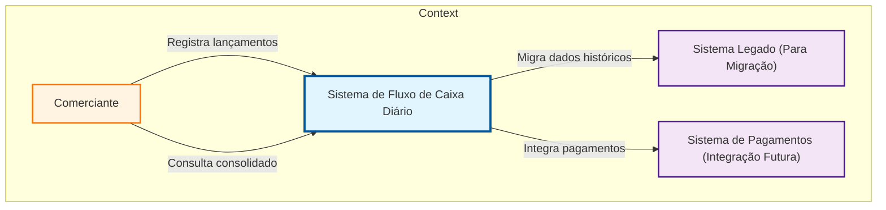
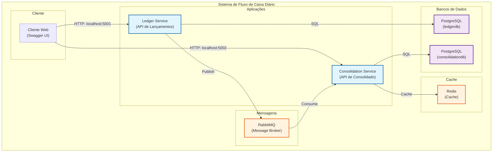
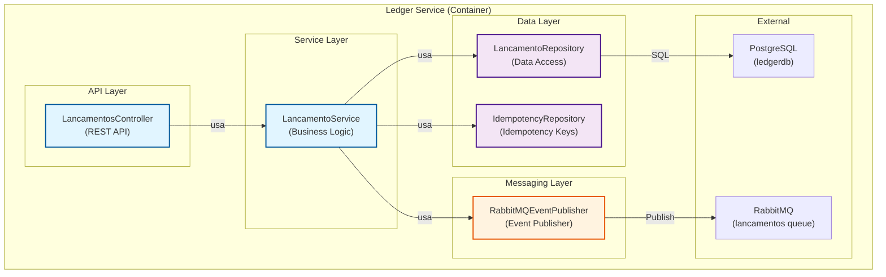
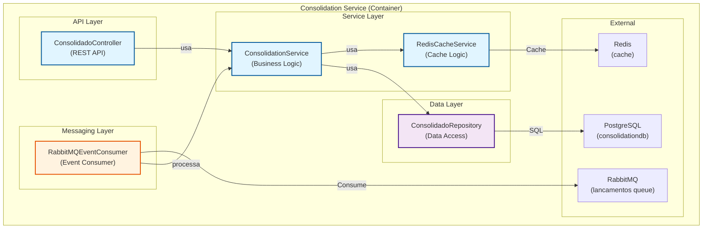

# Diagramas C4 - Projeto Desafio Carrefour

## C4-1: Context Diagram

### Descrição:
Mostra o sistema e seu contexto (atores externos, sistemas externos)



### Legenda:
- **Comerciante:** Usuário principal que usa o sistema
- **Sistema de Fluxo de Caixa Diário:** Sistema que você desenvolveu
- **Sistema Legado:** Sistema antigo (para migração futura)
- **Sistema de Pagamentos:** Sistema externo (integração futura)

---

## C4-2: Container Diagram

### Descrição:
Mostra os containers (aplicações, bancos, filas) e suas relações



### Legenda:
- **Cliente Web:** Swagger UI para testar as APIs
- **Ledger Service:** API que recebe lançamentos
- **Consolidation Service:** API que processa consolidado
- **RabbitMQ:** Message broker para comunicação assíncrona
- **Redis:** Cache para performance
- **PostgreSQL (ledgerdb):** Banco de dados de lançamentos
- **PostgreSQL (consolidationdb):** Banco de dados de consolidados

---

## C4-3: Component Diagram - Ledger Service

### Descrição:
Mostra os componentes dentro do Ledger Service



### Legenda:
- **LancamentosController:** Controller REST API
- **LancamentoService:** Lógica de negócio
- **LancamentoRepository:** Acesso a dados de lançamentos
- **IdempotencyRepository:** Acesso a dados de idempotência
- **RabbitMQEventPublisher:** Publicador de eventos no RabbitMQ

---

## C4-3: Component Diagram - Consolidation Service

### Descrição:
Mostra os componentes dentro do Consolidation Service



### Legenda:
- **ConsolidadoController:** Controller REST API
- **ConsolidationService:** Lógica de negócio de consolidação
- **RedisCacheService:** Lógica de cache
- **ConsolidadoRepository:** Acesso a dados de consolidados
- **RabbitMQEventConsumer:** Consumidor de eventos do RabbitMQ

---

## 🎯 Como usar esses diagramas:

### 1. Adicionar ao projeto:
- Criar arquivo: `c:\desafio\diagrams\c4-context.mmd`
- Criar arquivo: `c:\desafio\diagrams\c4-container.mmd`
- Criar arquivo: `c:\desafio\diagrams\c4-component-ledger.mmd`
- Criar arquivo: `c:\desafio\diagrams\c4-component-consolidation.mmd`

### 2. Adicionar ao README:
```markdown
## Diagramas C4

### Context Diagram
Arquivo: diagrams/c4-context.mmd
Mostra o sistema e seu contexto (comerciante, sistema legado, sistema de pagamentos)

### Container Diagram
Arquivo: diagrams/c4-container.mmd
Mostra os containers (Ledger Service, Consolidation Service, RabbitMQ, PostgreSQL, Redis)

### Component Diagram - Ledger Service
Arquivo: diagrams/c4-component-ledger.mmd
Mostra os componentes dentro do Ledger Service (Controller, Service, Repository, Event Publisher)

### Component Diagram - Consolidation Service
Arquivo: diagrams/c4-component-consolidation.mmd
Mostra os componentes dentro do Consolidation Service (Controller, Service, Repository, Event Consumer)
```

### 3. Para a entrevista:
"Usei o modelo C4 para documentar a arquitetura. Criei:
- Context Diagram: mostra o sistema e seu contexto (comerciante, sistema legado)
- Container Diagram: mostra os containers (Ledger Service, Consolidation Service, RabbitMQ, PostgreSQL, Redis)
- Component Diagram: mostra os componentes dentro de cada container (controllers, services, repositories)
- Isso permite comunicação clara entre stakeholders e desenvolvedores."

---

## 💡 Diferença entre seus diagramas atuais e C4:

### Seus diagramas atuais:
- Focam em fluxo de dados
- São úteis para entender processo
- Mas não seguem hierarquia C4

### Diagramas C4:
- Hierarquia explícita: Context → Container → Component
- Linguagem padrão da indústria
- Mais estruturado e formal
- Focam em estrutura, não apenas fluxo

---

**Quer que eu crie esses arquivos .mmd no seu projeto?**
