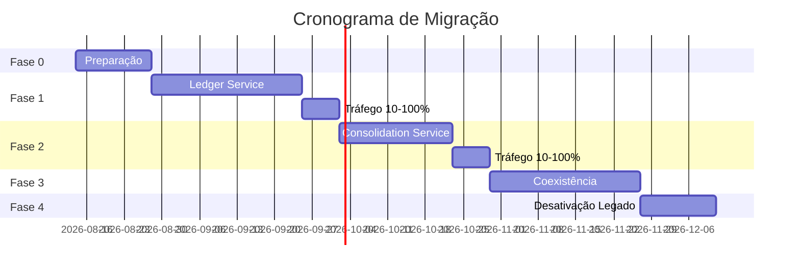

# Arquitetura de Transição

## Contexto

Este documento descreve a arquitetura de transição para migração de um sistema legado hipotético para a nova arquitetura baseada em microsserviços.

---

## Cenário Legado Assumido

### Sistema Atual (Monolito)

**Arquitetura:**
- Monolito .NET Framework 4.8
- Banco de dados SQL Server único
- Aplicação ASP.NET MVC
- Sem separação de responsabilidades

**Problemas Identificados:**
- Acoplamento alto entre lançamentos e consolidação
- Dificuldade de escalar componentes específicos
- Falhas em um componente afetam todo o sistema
- Deploy monolítico (tudo ou nada)
- Tecnologia legada difícil de manter

**Requisitos de Migração:**
- Tempo de inatividade mínimo
- Migração gradual (fases)
- Continuidade do negócio
- Preservação de dados históricos

---

## Estratégia de Migração: Strangler Fig Pattern

### Visão Geral

O padrão **Strangler Fig** será utilizado para migrar gradualmente do monolito para os novos microsserviços.

**Conceito:**
- Criar novos serviços ao redor do legado
- Redirecionar tráfego gradualmente
- "Estrangular" o legado aos poucos
- Eventualmente desativar o monolito

---

## Fases da Migração

### Fase 0: Preparação

**Atividades:**
- [ ] Setup da infraestrutura AWS
- [ ] Configurar bancos de dados PostgreSQL
- [ ] Configurar RabbitMQ
- [ ] Configurar Redis
- [ ] Estabelecer pipeline de CI/CD
- [ ] Backup completo do legado

**Tempo estimado:** 2 semanas

---

### Fase 1: Parallel Run (Lançamentos)

**Objetivo:** Migrar serviço de lançamentos

**Abordagem:**
1. Implementar Ledger Service (microsserviço)
2. Configurar sync de dados do legado para PostgreSQL
3. Deploy do novo serviço em paralelo
4. Redirecionar 10% do tráfego para o novo serviço
5. Monitorar e validar
6. Aumentar gradualmente para 50%, 100%

**Arquitetura:**
```
┌─────────────┐
│   Cliente   │
└──────┬──────┘
       │
       ▼
┌─────────────┐
│  Load       │
│  Balancer   │
└──────┬──────┘
       │
       ├───▶ Legado (90%)
       │
       └───▶ Ledger Service (10% → 100%)
              │
              ▼
         PostgreSQL
```

**Sincronização de Dados:**
- CDC (Change Data Capture) do SQL Server para PostgreSQL
- Job batch noturno para dados históricos
- Validação de consistência

**Critérios de Sucesso:**
- Performance igual ou superior ao legado
- Zero perda de dados
- Estabilidade por 2 semanas

**Tempo estimado:** 4 semanas

---

### Fase 2: Parallel Run (Consolidação)

**Objetivo:** Migrar serviço de consolidação

**Abordagem:**
1. Implementar Consolidation Service
2. Configurar eventos do Ledger Service
3. Consumer processa eventos e popula consolidado
4. Deploy em paralelo com legado
5. Comparar resultados (legado vs novo)
6. Redirecionar tráfego gradualmente

**Arquitetura:**
```
┌─────────────┐
│   Cliente   │
└──────┬──────┘
       │
       ▼
┌─────────────┐
│  Load       │
│  Balancer   │
└──────┬──────┘
       │
       ├───▶ Legado Consolidado (50%)
       │
       └───▶ Consolidation Service (50% → 100%)
              ▲
              │
         RabbitMQ
              ▲
              │
         Ledger Service
```

**Validação:**
- Comparar saldos calculados (legado vs novo)
- Reconciliação diária
- Alertas para divergências > 0.01

**Critérios de Sucesso:**
- Consolidados idênticos ao legado
- Performance aceitável
- Processamento de backlog completo

**Tempo estimado:** 3 semanas

---

### Fase 3: Coexistência

**Objetivo:** Operar ambos sistemas até estabilização

**Atividades:**
- [ ] Operar 100% no novo sistema
- [ ] Manter legado em read-only como backup
- [ ] Treinar equipe na nova arquitetura
- [ ] Documentar operações
- [ ] Otimizar performance

**Tempo estimado:** 4 semanas

---

### Fase 4: Desativação do Legado

**Objetivo:** Remover sistema legado

**Atividades:**
- [ ] Validar que legado não é mais acessado
- [ ] Backup final do legado
- [ ] Desligar servidores do legado
- [ ] Arquivar código legado
- [ ] Liberar recursos do legado

**Critérios:**
- Zero tráfego no legado por 30 dias
- Todos os testes passando
- Equipe confortável com novo sistema

**Tempo estimado:** 2 semanas

---

## Total do Cronograma

| Fase | Duração | Acumulado |
|------|---------|-----------|
| Fase 0: Preparação | 2 semanas | 2 semanas |
| Fase 1: Lançamentos | 4 semanas | 6 semanas |
| Fase 2: Consolidação | 3 semanas | 9 semanas |
| Fase 3: Coexistência | 4 semanas | 13 semanas |
| Fase 4: Desativação | 2 semanas | 15 semanas |

**Total:** 15 semanas (~3.5 meses)

---

## Estratégia de Dados

### Migração de Dados

**Abordagem Híbrida:**

1. **Dados Históricos (Batch)**
   - Export do SQL Server
   - Transformação de schema
   - Import para PostgreSQL
   - Validação de contagem e checksums

2. **Dados Incrementais (CDC)**
   - Change Data Capture do SQL Server
   - Captura de inserts/updates/deletes
   - Replicação em tempo real para PostgreSQL
   - Durante Fase 1 e 2

3. **Cutover**
   - Parar escrita no legado
   - Esperar replicação finalizar
   - Validar consistência
   - Iniciar escrita no novo sistema

### Schema Mapping

| Legado (SQL Server) | Novo (PostgreSQL) | Observações |
|---------------------|-------------------|-------------|
| dbo.Lancamentos | lancamentos | Tipo de dados ajustado |
| dbo.Consolidado | consolidado_diario | Índices otimizados |
| dbo.Usuarios | (novo) users | Novo sistema de auth |

---

## Estratégia de Rollback

### Rollback Plan

**Se algo der errado em qualquer fase:**

1. **Imediato (Minutos):**
   - Redirecionar tráfego de volta ao legado
   - Ativar modo read-only no novo sistema
   - Investigar problema

2. **Curto Prazo (Horas):**
   - Restaurar backup se necessário
   - Corrigir problema
   - Testar novamente

3. **Longo Prazo (Dias):**
   - Se problema crítico, abortar fase
   - Revisar estratégia
   - Tentar novamente após correções

**Critérios de Rollback:**
- Perda de dados
- Degradação severa de performance (>50%)
- Bugs críticos em produção
- Disponibilidade < 99%

---

## Riscos e Mitigações

### Risco 1: Incompatibilidade de Dados

**Descrição:** Schema do legado não mapeia perfeitamente para o novo

**Mitigação:**
- Análise detalhada do schema antes
- Scripts de transformação robustos
- Validação em ambiente de staging
- Rollback planejado

### Risco 2: Performance Inferior

**Descrição:** Novo sistema mais lento que legado

**Mitigação:**
- Load testing antes do cutover
- Cache e otimizações
- Scale horizontal se necessário
- Monolito ainda disponível como fallback

### Risco 3: Perda de Dados

**Descrição:** Perda durante migração ou cutover

**Mitigação:**
- Backups múltiplos
- CDC para garantir sincronização
- Validação de checksums
- Transações atômicas
- Rollback instantâneo

### Risco 4: Complexidade Operacional

**Descrição:** Equipe não familiarizada com nova arquitetura

**Mitigação:**
- Treinamento antes da migração
- Documentação detalhada
- Suporte de arquitetura sênior
- Fase de coexistência longa

### Risco 5: Dependências Externas

**Descrição:** Novos serviços (RabbitMQ, Redis) falharem

**Mitigação:**
- HA em todos os componentes
- Monitoramento proativo
- Fallback para processamento síncrono
- SLAs estabelecidos com fornecedores

---

## Comunicação e Stakeholders

### Plano de Comunicação

**Stakeholders:**
- Business Owners
- Equipe de Desenvolvimento
- Equipe de Operações
- Equipe de Suporte
- Usuários Finais

**Comunicação:**
- **Semanal:** Status update para stakeholders
- **Diária:** Standup com equipe técnica
- **Real-time:** Alertas críticos
- **Pós-fase:** Retrospectiva e lições aprendidas

---

## Métricas de Sucesso

### Métricas Técnicas

- [ ] Zero perda de dados
- [ ] Disponibilidade ≥ 99.5%
- [ ] Latência P95 ≤ 200ms
- [ ] Error rate ≤ 1%
- [ ] Sucesso em todos os testes

### Métricas de Negócio

- [ ] Tempo de inatividade < 4 horas total
- [ ] Sem impacto para usuários finais
- [ ] Relatórios financeiros corretos
- [ ] Auditoria sem pendências

### Métricas de Projeto

- [ ] Dentro do cronograma (15 semanas)
- [ ] Dentro do orçamento
- [ ] Equipe treinada
- [ ] Documentação completa

---

## Pós-Migração

### Atividades Pós-Go-Live

1. **Monitoramento Intensivo** (primeiras 2 semanas)
   - Dashboards 24/7
   - Alertas sensíveis
   - Reuniões diárias de status

2. **Otimização** (semanas 3-4)
   - Ajustar based em métricas reais
   - Otimizar queries
   - Ajustar scaling

3. **Desligamento do Legado** (semana 5+)
   - Validar não-utilização
   - Backup final
   - Desligamento
   - Liberação de recursos

4. **Retrospectiva**
   - Lições aprendidas
   - Melhorias para próximos projetos
   - Documentação de arquitetura final

---

## Diagrama de Transição



---

## Conclusão

A arquitetura de transição proposta utiliza o padrão Strangler Fig para uma migração segura e gradual, minimizando riscos e garantindo continuidade do negócio. O cronograma de 15 semanas é realista considerando a complexidade e a necessidade de validação em cada fase.

**Próximos Passos:**
- Aprovação do plano por stakeholders
- Detalhamento técnico de cada fase
- Setup de ambiente de staging
- Início da Fase 0

---

**Status:** Plano proposto - Sujeito a aprovação e ajustes
