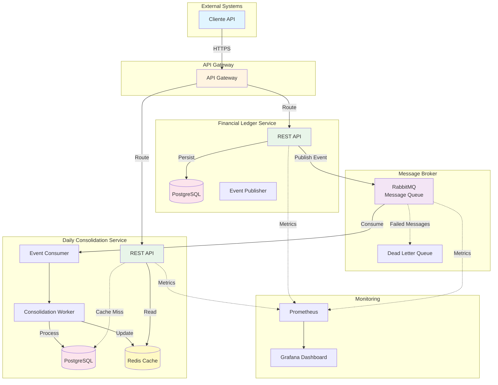
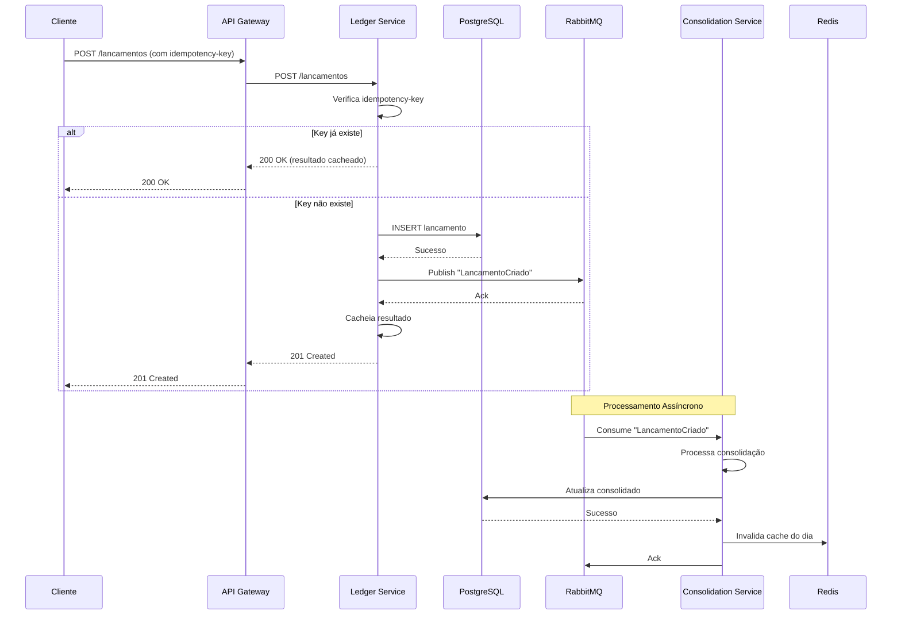
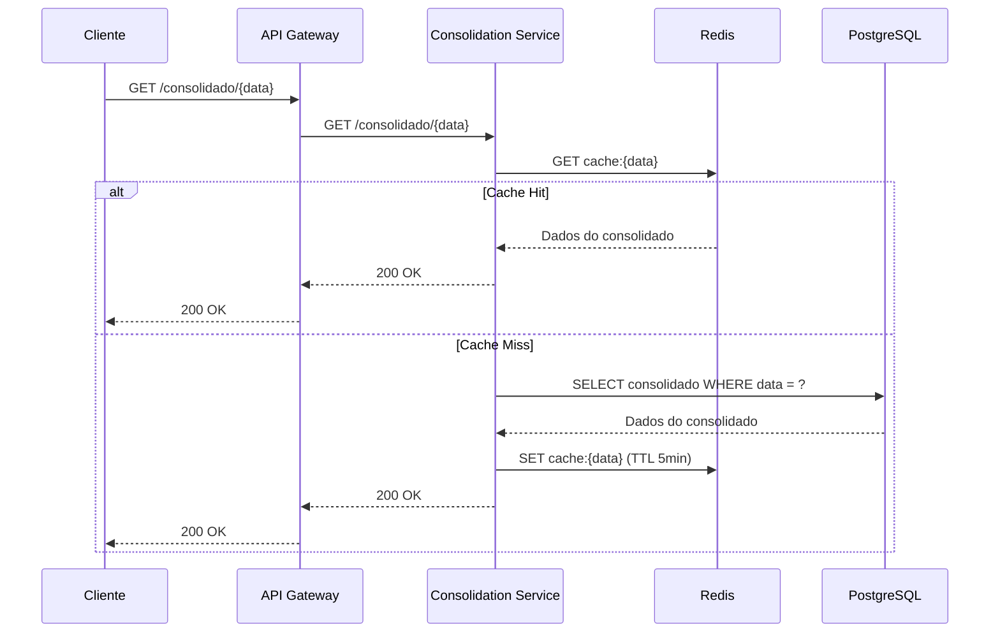
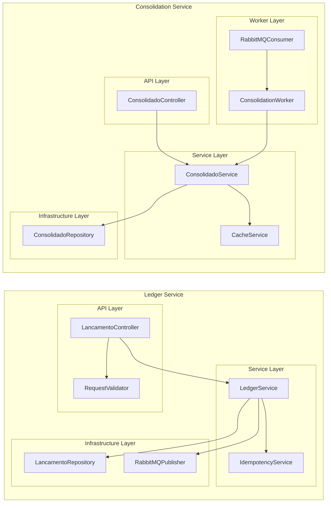
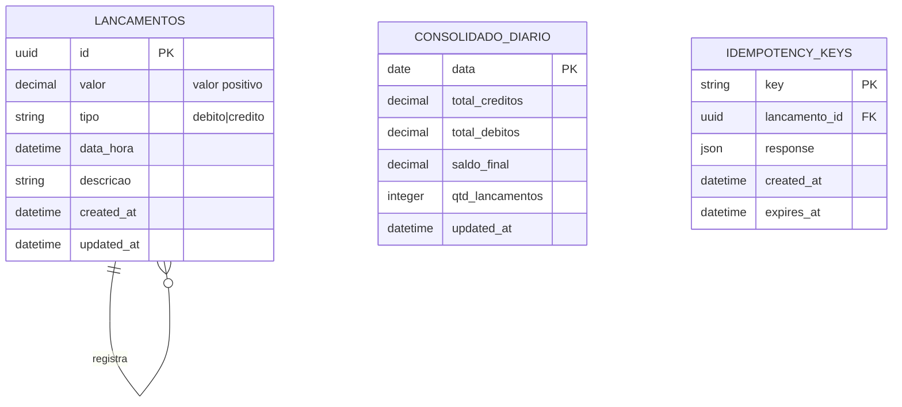
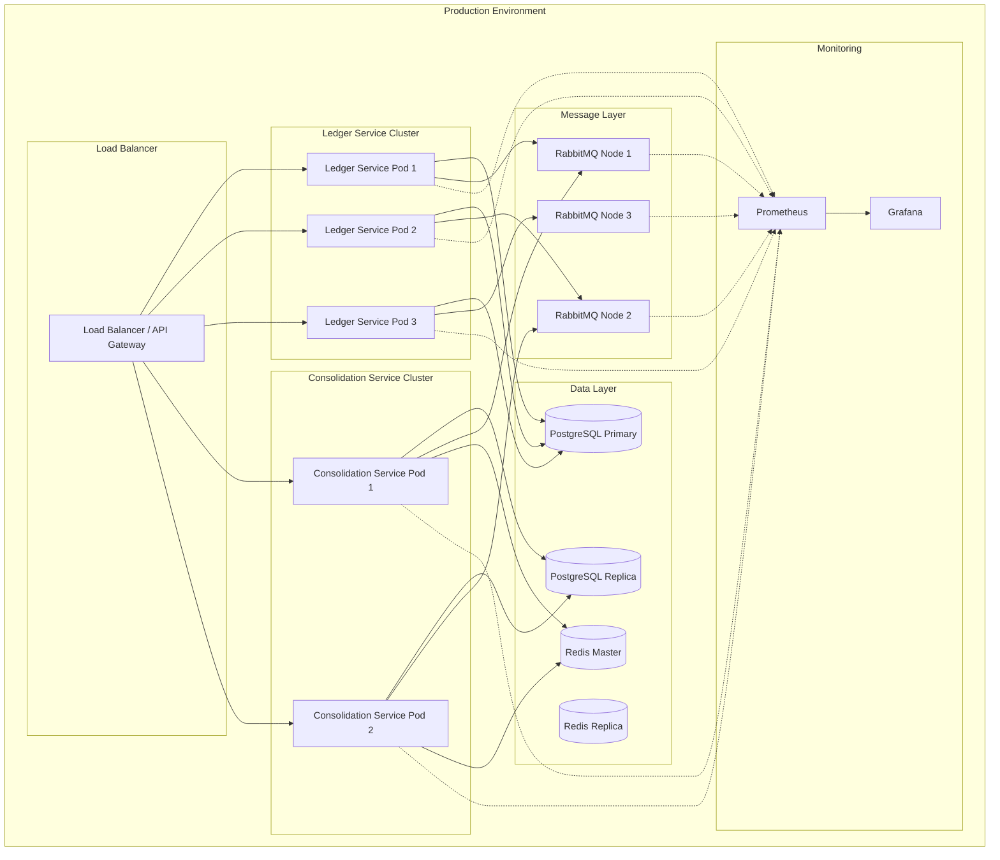

# Diagramas da Arquitetura

Este documento contém os diagramas da arquitetura da solução, usando Mermaid para visualização.

---

## Diagrama 1: Contexto da Arquitetura



---

## Diagrama 2: Fluxo de Lançamento



---

## Diagrama 3: Fluxo de Consulta de Consolidado



---

## Diagrama 4: Arquitetura de Componentes



---

## Diagrama 5: Modelo de Dados



---

## Diagrama 6: Arquitetura de Deploy



---

## Diagrama 7: Escalabilidade e Performance

```mermaid
graph LR
    subgraph "Pico de Carga (50 req/s)"
        Load["50 req/s"]
    end
    
    subgraph "Camada 1: API Gateway"
        GW1[Rate Limiting]
        GW2[Load Balancing]
    end
    
    subgraph "Camada 2: Ledger Service"
        LS1[Scale out<br/>3 instâncias]
        LS2[~17 req/s cada]
    end
    
    subgraph "Camada 3: Message Queue"
        MQ1[Buffer<br/>RabbitMQ]
        MQ2[Spikes absorvidos]
    end
    
    subgraph "Camada 4: Consolidation Service"
        CS1[Scale out<br/>2 instâncias]
        CS2[~25 req/s cada]
    end
    
    subgraph "Camada 5: Cache"
        R1[Redis]
        R2[Cache hit<br/>~90%]
    end
    
    Load --> GW1
    GW1 --> GW2
    GW2 --> LS1
    LS1 --> LS2
    LS2 --> MQ1
    MQ1 --> MQ2
    MQ2 --> CS1
    CS1 --> CS2
    CS2 --> R1
    R1 --> R2
```



---

## Diagrama 8: Tratamento de Falhas e Resiliência

```mermaid
graph TB
    subgraph "Cenário: Consolidation Service Down"
        LS[Ledger Service]
        MQ[RabbitMQ]
        CS_down[Consolidation Service ❌]
        MQ_full[Queue Building Up]
        CS_up[Consolidation Service ✅]
        DLQ[Dead Letter Queue]
    end
    
    LS -->|Publish| MQ
    MQ -.->|Consume| CS_down
    MQ -->|Messages Queued| MQ_full
    
    Note over MQ_full: Messages persistem<br/>não são perdidos
    
    CS_up -->|Resume Consuming| MQ
    MQ -->|Process Backlog| CS_up
    
    MQ -.->|Max Retries| DLQ
    
    style CS_down fill:#ffcdd2
    style CS_up fill:#c8e6c9
```

---

## Como Visualizar

### Opção 1: VS Code com Mermaid Preview
1. Instale a extensão "Markdown Preview Mermaid Support"
2. Abra este arquivo no VS Code
3. Use o preview para visualizar os diagramas

### Opção 2: Mermaid Live Editor
1. Acesse https://mermaid.live
2. Copie o código de cada diagrama
3. Cole no editor para visualizar

### Opção 3: GitHub/GitLab
1. Faça commit deste arquivo
2. GitHub e GitLab renderizam diagramas Mermaid automaticamente

---

**Status:** Diagramas base - Podem ser refinados conforme implementação
